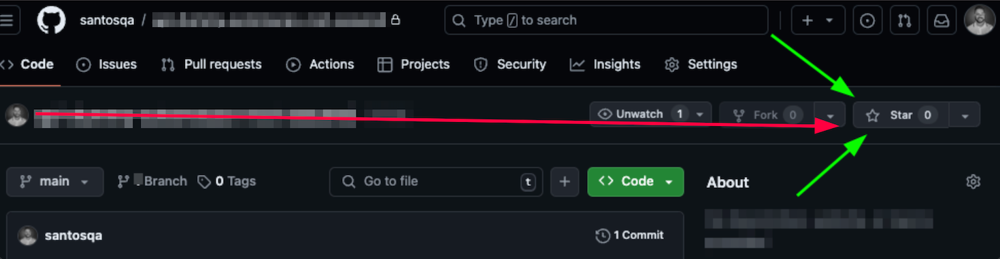

<p align="center">
  <a href="https://santosqa.github.io/" target="_blank" rel="noopener noreferrer">
    <picture>
      <source media="(prefers-color-scheme: dark)"  srcset="./assets/cypress-logo-dark.png">
      <source media="(prefers-color-scheme: light)" srcset="./assets/cypress-logo-light.png">
      
    </picture>
  </a>
</p>

---

> 💡 **Dica**: Use Ctrl+Click (Windows/Linux) ou Cmd+Click (Mac) para abrir os links em uma nova aba.

[](https://santosqa.github.io) [](https://github.com/santosqa) [](https://www.linkedin.com/in/santosqa) [](https://www.instagram.com/santosqa_/) [](https://www.santosqa.com) [](https://www.apartamentovistamar.com/) [](https://santosqa.github.io/receitas/) [](https://santosqa.github.io/santos-locais-turisticos/)


---


# 💻 Cypress Express Web API

Conheça a Trilha de Cypress na Udemy e aprenda a criar testes automatizados para WEB e API com Cypress!

👉🏼  https://itau.udemy.com/learning-paths/9480633/

O Cypress é uma ferramenta moderna de automação de testes. 

Com Cypress, é possível realizar testes end-to-end de forma eficiente e simples, validando o comportamento da aplicação de ponta a ponta, com foco na interação com os elementos presentes na maioria das páginas web e api. Além disso, a ferramenta fornece uma série de recursos como captura de telas, gravação de vídeos, depuração em tempo real e relatórios de testes, tornando o processo de automação e validação mais acessível.

## Benefícios do Cypress:
  **Desempenho Rápido:** Execução instantânea de testes, sem a necessidade de esperar por longos tempos de execução.
  **Depuração Simples:** Ferramentas de depuração e exibição de comandos diretamente no navegador.
  **Testes em Tempo Real:** Visualização do comportamento da aplicação enquanto os testes estão sendo executados.
  **Facilidade de Uso:** Sintaxe simples e APIs intuitivas para escrever testes, ideal para iniciantes e especialistas.
  **Documentação Extensa:** A documentação oficial oferece exemplos e guias para facilitar o aprendizado.

<div style="background-color: #ffd9c9; padding: 10px; border-radius: 5px;" role="alert" aria-live="assertive">
  <strong>⚠️ Atenção!</strong><br>
  <p>As URLs e credenciais usadas neste projeto são de propriedade exclusiva de pessoas matriculadas nos cursos contido na Trilha de Cypress da Udemy. <em>Não utilize-as sem autorização.</em></p>
</div></br>

[](https://www.santosqa.com/top/) 

<div style="background-color: #DDA0DD; padding: 10px; border-radius: 5px;" role="note" aria-live="polite">
  <p>💡 Este repositório é o seu ponto de partida para automatizar testes em diferentes camadas com Cypress. Crie scripts poderosos, escaláveis e prontos para dominar qualquer aplicação! 🚀💻</p>
  <p>⚡ Comece sua jornada de automação e leve seus testes para o próximo nível. O futuro dos testes está em suas mãos. Vamos juntos nesse desafio! 💪</p>
</div>


---
## ⭐️ Deixe uma estrela para apoiar o projeto 👍🏽

<p align="center">
  
</p>


----------------------

## Links Úteis
  
  - yarn: https://yarnpkg.com/
  - package cypress yarn: https://yarnpkg.com/package?q=cypress&name=cypress
  - github cypress: https://github.com/cypress-io/cypress


----------------------

## DOC Cypress 
  - Viewport: https://docs.cypress.io/api/commands/viewport
  - Hooks BeforeEach: https://docs.cypress.io/guides/core-concepts/writing-and-organizing-tests#Hooks

---
## Extensões VsCode
[](https://marketplace.visualstudio.com/items?itemName=tal7aouy.rainbow-bracket) [](https://marketplace.visualstudio.com/items?itemName=dracula-theme.theme-dracula) [](https://marketplace.visualstudio.com/items?itemName=esbenp.prettier-vscode) [](https://marketplace.visualstudio.com/items?itemName=AtomMaterial.a-file-icon-vscode) [](https://marketplace.visualstudio.com/items?itemName=shd101wyy.markdown-preview-enhanced) [](https://marketplace.visualstudio.com/items?itemName=MS-CEINTL.vscode-language-pack-pt-BR) [](https://github.com/tonsky/FiraCode)

####
----------------------

## Clonar o projeto

- Clone projeto usando o comando: 
```bash
git clone https://github.com/santosqa/cypress-express-web-api.git
```
- Na pasta raiz do projeto, execute o comando para remover o versionamento: 
```bash 
rm -rf .git 
```
- Iniciar um novo repositorio Git: 
```bash 
git init
```

##### Comandos Adicionais para o Git:

- Criar e mudar para uma nova branch: 
```bash 
git checkout -b nome_da_branch_desejada
```
- Mudar para uma branch existente: 
```bash 
git checkout nome_da_branch_desejada
```
----------------------

## Ambiente 


##### Dentro da pasta API
- 1 - Instale o nvm | ```nvm install 18``` (caso já tenha, pule este passo)
- 2 - Use a versão 18 | ```nvm use 18```  (caso já esteja usando, pule este passo)
- 3 - Instale as dependencias | ``` npm install``` 
- 4 - inicie o banco de dados | ```npm run db:init``` 
- 5 - inicie a api | ```npm run dev``` 
	-  6. Caso ocorra erro sqlite3
		- 6.1 - Verifique a versão do node | ```node -v``` (precisa ser o 18)
		- 6.2 - Verifique a versão do módulo | ```npm list better-sqlite3```  
		- 6.3 - Recompile o módulo | ``` npm rebuild better-sqlite3 ``` 
		- 6.4 - Atualize o módulo se necessário | ```npm install better-sqlite3@latest```

##### Dentro da pasta WEB
- 1 - Instale as dependencias | ```npm install``` 
- 2 - inicie a Aplicação WEb |  ```npm run dev``` 
- 3 - Url da aplicação | lcoalhost:3000 

##### Dentro da pasta test
- 1 - Ativar core pack | ```sudo corepack enable```  (caso já tenha aitivo, pule este passo)
- 2 - iniciar o projeto | ```yarn init``` 
- 3 - instalar cypress | ``` yarn add cypress@12.2.0 -D ``` 
- 4 - abrir cypress | ```cypress open```

###

---

> 🔥  Dica 1  
> No Arquivo .gitignored, o padrão `**/` significa "em qualquer nível de diretório". Isso garante que os diretórios e arquivos sejam ignorados em qualquer lugar do projeto, não apenas na raiz. Exemplo:  `**/node_modules/`  em qualquer lugar do projeto que existir a pasta node_modules, será ignorado ao enviar para o repositório remoto.


> 🔥  Dica 2  
> Em sua página de testes `seuTest.cy.js` inicie sempre com a anotação `/// <reference types="cypress" />` para que seja habilitado o uso do IntelliSense. Isso ajudará você a escrever testes de forma mais eficiente, com sugestões de código e autocompletar.

---

[Ricardo Santos QA](https://github.com/santosqa) 👋🏼
